Ecoinvent geography definitions
===============================

Table of Contents
-----------------

.. contents::

Introduction
------------

The ecoinvent centre provide consistent and comprehensive geodata for the locations used in the ecoinvent database. This document describes how these location geometries are created and processed, and gives details on particular locations that may be confusing.

Purpose of location data in ecoinvent
-------------------------------------

Location data in ecoinvent is used to locate inventory processes in space, define and construct market and market inputs, and for various forms of regionalized life cycle inventory analysis and impact assessment.

Statement on geographical controversies
---------------------------------------

Neither the EcoSpold 2 data format, nor its authors, take any position on geographical areas of controversy. The geographical shapes presented in the EcoSpold 2 data files should not be taken as absolute definitions of country or region borders. Rather, they are approximations consistent with common understanding of these countries and regions, for use in a life cycle inventory database. If subjective judgments have to be made, we have made choices based on our understanding of what would be best for clear and understandable life cycle inventories. If you find a error or discrepancy in the base data file, please let us know by `filing a bug <https://github.com/ecoinvent/ecoinvent-topology/issues>`_.

Data formats
------------

The official ecospold2 format for specifying geographies is a single XML file, with location geodata included in the `KML <http://en.wikipedia.org/wiki/Keyhole_Markup_Language>`__ format *inside* the XML file. The official geographies file is here:

* `Geographies.xml (bzip2 compressed) <https://geography.ecoinvent.org/files/Geographies.xml.bz2>`__

However, this format is not easy to work with for most programming languages or GIS programs. The location data and metadata are also available in a number of GIS formats. Selections of the location data are also provided, as a single file containing all regions can be a bit unwieldy.

+------------------------------------+---------------------------------------------------------------------------------+-----------------------------------------------------------------------------+---------------------------------------------------------------------+--------------------------------------------------------------------------------------+
| Description                        | `GeoJSON <http://geojson.org/>`__                                               | `Geopackage <http://www.geopackage.org/>`__                                 | `KMZ <http://en.wikipedia.org/wiki/Keyhole_Markup_Language>`__      | `ESRI Shapefile <http://en.wikipedia.org/wiki/Shapefile>`__                          |
+====================================+=================================================================================+=============================================================================+=====================================================================+======================================================================================+
| All locations                      | `GeoJSON <https://geography.ecoinvent.org/files/all.geojson.bz2>`__             | `Geopackage <https://geography.ecoinvent.org/files/all.gpkg>`__             | `KMZ <https://geography.ecoinvent.org/files/all.kmz>`__             | `ESRI Shapefile <https://geography.ecoinvent.org/files/all.zip>`__                   |
+------------------------------------+---------------------------------------------------------------------------------+-----------------------------------------------------------------------------+---------------------------------------------------------------------+--------------------------------------------------------------------------------------+
| Countries                          | `GeoJSON <https://geography.ecoinvent.org/files/countries.geojson.bz2>`__       | `Geopackage <https://geography.ecoinvent.org/files/countries.gpkg>`__       | `KMZ <https://geography.ecoinvent.org/files/countries.kmz>`__       | `ESRI Shapefile <https://geography.ecoinvent.org/files/countries.zip>`__             |
+------------------------------------+---------------------------------------------------------------------------------+-----------------------------------------------------------------------------+---------------------------------------------------------------------+--------------------------------------------------------------------------------------+
| All ecoinvent except for countries | `GeoJSON <https://geography.ecoinvent.org/files/all-ecoinvent.geojson.bz2>`__   | `Geopackage <https://geography.ecoinvent.org/files/all-ecoinvent.gpkg>`__   | `KMZ <https://geography.ecoinvent.org/files/all-ecoinvent.kmz>`__   | `ESRI Shapefile <https://geography.ecoinvent.org/files/all-ecoinvent.zip>`__         |
+------------------------------------+---------------------------------------------------------------------------------+-----------------------------------------------------------------------------+---------------------------------------------------------------------+--------------------------------------------------------------------------------------+
| UN regions                         | `GeoJSON <https://geography.ecoinvent.org/files/un-regions.geojson.bz2>`__      | `Geopackage <https://geography.ecoinvent.org/files/un-regions.gpkg>`__      | `KMZ <https://geography.ecoinvent.org/files/un-regions.kmz>`__      | `ESRI Shapefile <https://geography.ecoinvent.org/files/un-subregions.geojson.bz2>`__ |
+------------------------------------+---------------------------------------------------------------------------------+-----------------------------------------------------------------------------+---------------------------------------------------------------------+--------------------------------------------------------------------------------------+
| UN subregions                      | `GeoJSON <https://geography.ecoinvent.org/files/un-subregions.geojson.bz2>`__   | `Geopackage <https://geography.ecoinvent.org/files/un-subregions.kmz>`__    | `KMZ <https://geography.ecoinvent.org/files/un_regions.zip>`__      | `ESRI Shapefile <https://geography.ecoinvent.org/files/un_subregions.zip>`__         |
+------------------------------------+---------------------------------------------------------------------------------+-----------------------------------------------------------------------------+---------------------------------------------------------------------+--------------------------------------------------------------------------------------+
| Electricity networks               | `GeoJSON <https://geography.ecoinvent.org/files/electricity.geojson.bz2>`__     | `Geopackage <https://geography.ecoinvent.org/files/electricity.gpkg>`__     | `KMZ <https://geography.ecoinvent.org/files/electricity.kmz>`__     | `ESRI Shapefile <https://geography.ecoinvent.org/files/electricity.zip>`__           |
+------------------------------------+---------------------------------------------------------------------------------+-----------------------------------------------------------------------------+---------------------------------------------------------------------+--------------------------------------------------------------------------------------+
| Legacy Electricity networks        | `GeoJSON <https://geography.ecoinvent.org/files/legacy.geojson.bz2>`__          | `Geopackage <https://geography.ecoinvent.org/files/legacy.gpkg>`__          | `KMZ <https://geography.ecoinvent.org/files/legacy.kmz>`__          | `ESRI Shapefile <https://geography.ecoinvent.org/files/legacy.zip>`__                |
+------------------------------------+---------------------------------------------------------------------------------+-----------------------------------------------------------------------------+---------------------------------------------------------------------+--------------------------------------------------------------------------------------+
| Electricity networks (USA only)    | `GeoJSON <https://geography.ecoinvent.org/files/usa-electricity.geojson.bz2>`__ | `Geopackage <https://geography.ecoinvent.org/files/usa-electricity.gpkg>`__ | `KMZ <https://geography.ecoinvent.org/files/usa-electricity.kmz>`__ | `ESRI Shapefile <https://geography.ecoinvent.org/files/usa_electricity.zip>`__       |
+------------------------------------+---------------------------------------------------------------------------------+-----------------------------------------------------------------------------+---------------------------------------------------------------------+--------------------------------------------------------------------------------------+
| Aluminium-producing regions        | `GeoJSON <https://geography.ecoinvent.org/files/aluminium.geojson.bz2>`__       | `Geopackage <https://geography.ecoinvent.org/files/aluminium.gpkg>`__       | `KMZ <https://geography.ecoinvent.org/files/aluminium.kmz>`__       | `ESRI Shapefile <https://geography.ecoinvent.org/files/aluminium.zip>`__             |
+------------------------------------+---------------------------------------------------------------------------------+-----------------------------------------------------------------------------+---------------------------------------------------------------------+--------------------------------------------------------------------------------------+
| Europe/Asia                        | `GeoJSON <https://geography.ecoinvent.org/files/only-europe.geojson.bz2>`__     | `Geopackage <https://geography.ecoinvent.org/files/only-europe.gpkg>`__     | `KMZ <https://geography.ecoinvent.org/files/only-europe.kmz>`__     | `ESRI Shapefile <https://geography.ecoinvent.org/files/only_europe.zip>`__           |
+------------------------------------+---------------------------------------------------------------------------------+-----------------------------------------------------------------------------+---------------------------------------------------------------------+--------------------------------------------------------------------------------------+
| Russia                             | `GeoJSON <https://geography.ecoinvent.org/files/russia.geojson.bz2>`__          | `Geopackage <https://geography.ecoinvent.org/files/russia.gpkg>`__          | `KMZ <https://geography.ecoinvent.org/files/russia.kmz>`__          | `ESRI Shapefile <https://geography.ecoinvent.org/files/russia.zip>`__                |
+------------------------------------+---------------------------------------------------------------------------------+-----------------------------------------------------------------------------+---------------------------------------------------------------------+--------------------------------------------------------------------------------------+
| Ecoinvent special                  | `GeoJSON <https://geography.ecoinvent.org/files/special.geojson.bz2>`__         | `Geopackage <https://geography.ecoinvent.org/files/special.gpkg>`__         | `KMZ <https://geography.ecoinvent.org/files/special.kmz>`__         | `ESRI Shapefile <https://geography.ecoinvent.org/files/special.zip>`__               |
+------------------------------------+---------------------------------------------------------------------------------+-----------------------------------------------------------------------------+---------------------------------------------------------------------+--------------------------------------------------------------------------------------+
| Provinces and states               | `GeoJSON <https://geography.ecoinvent.org/files/states.geojson.bz2>`__          | `Geopackage <https://geography.ecoinvent.org/files/states.gpkg>`__          | `KMZ <https://geography.ecoinvent.org/files/states.kmz>`__          | `ESRI Shapefile <https://geography.ecoinvent.org/files/states.zip>`__                |
+------------------------------------+---------------------------------------------------------------------------------+-----------------------------------------------------------------------------+---------------------------------------------------------------------+--------------------------------------------------------------------------------------+

Methodology
-----------

The primary data source for the ecoinvent geodata is the `Natural Earth data <http://www.naturalearthdata.com/>`_, and in particular the `1:10 million cultural vectors, including boundary lakes <http://www.naturalearthdata.com/downloads/10m-cultural-vectors/>`_, both *Admin 0 – Countries* and *Admin 1 – States, Provinces*. In addition to Natural Earth, custom geometries were drawn for NERC regions in the United States of America which split individual states.

Processing begins by entering all province regions into a `PostGIS topological database <http://postgis.net/docs/Topology.html>`__. A topology is different from a normal geometry because it tries to store only one copy of each face edge and node, and a state or province would be defined by which common edges it bordered. For example, the boundary between France and Germany would be stored only once, and the topology of both France and Germany would reference that border. Topology is a rather complex subject which is not explained in detail here; interested readers should go through `this presentation by Sandro Santilli <http://strk.keybit.net/projects/postgis/Paris2011_TopologyWithPostGIS_2_0.pdf>`__. The use of topologies give several nice advantages:

* Consistency: Each border is only defined once. Modifications to border edges apply to all affected regions automatically.
* Integrity: All regions are automatically valid.
* Explicit relationships: It is fast and simple to determine spatial relationships among regions by comparing their topological faces. There is no potential for floating-point errors, as no geometry math is needed.

You can `download the current set of topological faces used in Ecoinvent here <https://geography.ecoinvent.org/files/faces.gpkg>`__.

After state/province-level data is imported, country data is imported. Country borders are automatically snapped to province borders by the database. A series of data cleaning steps is then applied. Specifically, the following is done:

* Provinces with self-intersecting borders are fixed using `ST_MakeValid <http://postgis.org/documentation/manual-svn/ST_MakeValid.html>`__. We don't think this is a problem in the 2023 release of Natural Earth, but is kept for safety.
* Countries whose ISO names are longer than normal, or whose names who result in unexpected sort order, are changed (``update_names.sql``). ``Republic of Serbia`` is changed to ``Serbia``
* ``Svalbard and Jan Mayen`` and ``Bouvet Island`` geometries are removed from ``Norway``; they have separate ISO codes
* ``Cyprus No Mans Area`` geometry is removed from ``Cyprus``; ``Cyprus No Mans Area`` is a separate location
* ``Tokelau`` geometry is removed from ``New Zealand``; ``Tokelau`` has a separate ISO code
* ``Baikonur cosmodrone`` is reassigned from ``Russia`` to ``Kazakhstan``
* ``Netherlands`` is redefined to not include its Caribbean islands, which have their own ISO code
* ``France`` is redefined to not include territories which have their own ISO codes (See :ref:`france`)
* ``Kosovo`` is given the provisional ISO code ``XK``.
* The Mandarin names of the Chinese provinces ``Heilongjiang`` and ``Qinghai`` are corrected.
* ``Democratic Republic of the Congo`` is changed to ``Congo, Democratic Republic of the``
* ``Republic of Congo`` is changed to ``Congo``
* ``Federated States of Micronesia`` is changed to ``Micronesia, Federated States of``
* ``United Republic of Tanzania`` is changed to ``Tanzania``

In addition, the ``United States of America`` is split into the regional transmission grids, whose borders do not follow state borders.

The basic topological units in the database are usually state/province-level regions, as in this visualization of Madagascar:

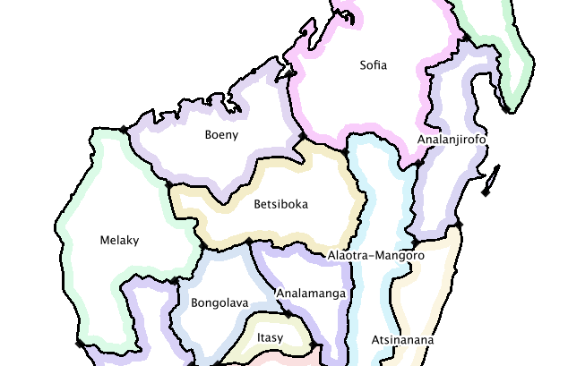

However, in some regions states are broken up, as in this visualization of the combination of NERC regions and state boundaries in the United States of America:

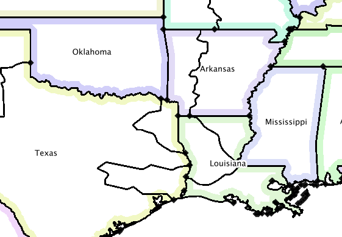

Ecoinvent regions are defined constructively, i.e. they are built up by adding together their smallest constituent units. Intersection or difference functions are not used, as they can lead to floating-point errors and small geometrical artifacts.

After a consistent topology is constructed, the regions used in ecoinvent are extracted. For example, ecoinvent provides Australian states, so these are added individually; however, state-level data in most other countries are not used, so only the country borders are extracted. The final ecoinvent topology of the world looks like this:

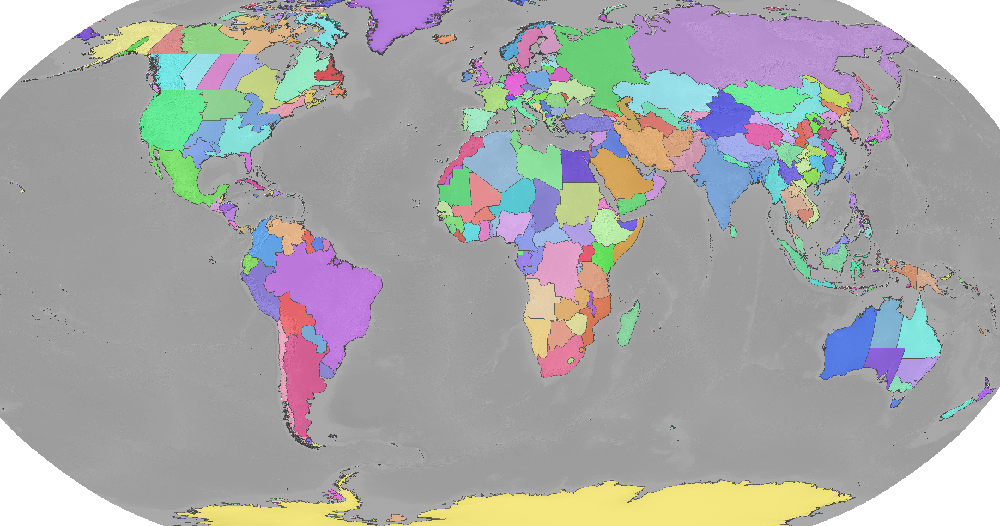

The input data and scripts to process, combine, and export all location data, as well as this manual, are open source and `freely available for download <https://bitbucket.org/cmutel/constructive-geometries>`__.

List of locations in ecoinvent
------------------------------

Countries
+++++++++

259 entities listed in `ISO 3166-1`_:

+-----------------------------------+------------------------------------------+-------------------------------------+------------------------------+
| Afghanistan                       | Akrotiri Sovereign Base Area             | Aland                               | Albania                      |
+-----------------------------------+------------------------------------------+-------------------------------------+------------------------------+
| Algeria                           | American Samoa                           | Andorra                             | Angola                       |
+-----------------------------------+------------------------------------------+-------------------------------------+------------------------------+
| Anguilla                          | Antarctica                               | Antigua and Barbuda                 | Argentina                    |
+-----------------------------------+------------------------------------------+-------------------------------------+------------------------------+
| Armenia                           | Aruba                                    | Ashmore and Cartier Islands         | Australia                    |
+-----------------------------------+------------------------------------------+-------------------------------------+------------------------------+
| Austria                           | Azerbaijan                               | Bahrain                             | Bajo Nuevo Bank (Petrel Is.) |
+-----------------------------------+------------------------------------------+-------------------------------------+------------------------------+
| Bangladesh                        | Barbados                                 | Belarus                             | Belgium                      |
+-----------------------------------+------------------------------------------+-------------------------------------+------------------------------+
| Belize                            | Benin                                    | Bermuda                             | Bhutan                       |
+-----------------------------------+------------------------------------------+-------------------------------------+------------------------------+
| Bolivia                           | Bonaire, Saint Eustatius and Saba        | Bosnia and Herzegovina              | Botswana                     |
+-----------------------------------+------------------------------------------+-------------------------------------+------------------------------+
| Bouvet Island                     | Brazil                                   | British Indian Ocean Territory      | British Virgin Islands       |
+-----------------------------------+------------------------------------------+-------------------------------------+------------------------------+
| Brunei                            | Bulgaria                                 | Burkina Faso                        | Burundi                      |
+-----------------------------------+------------------------------------------+-------------------------------------+------------------------------+
| Cambodia                          | Cameroon                                 | Canada                              | Cape Verde                   |
+-----------------------------------+------------------------------------------+-------------------------------------+------------------------------+
| Cayman Islands                    | Central African Republic                 | Chad                                | Chile                        |
+-----------------------------------+------------------------------------------+-------------------------------------+------------------------------+
| China                             | Clipperton Island                        | Colombia                            | Comoros                      |
+-----------------------------------+------------------------------------------+-------------------------------------+------------------------------+
| Congo                             | Congo, Democratic Republic of the        | Cook Islands                        | Costa Rica                   |
+-----------------------------------+------------------------------------------+-------------------------------------+------------------------------+
| Croatia                           | Cuba                                     | Curaçao                             | Cyprus                       |
+-----------------------------------+------------------------------------------+-------------------------------------+------------------------------+
| Cyprus No Mans Area               | Czechia                                  | Denmark                             | Dhekelia Sovereign Base Area |
+-----------------------------------+------------------------------------------+-------------------------------------+------------------------------+
| Djibouti                          | Dominica                                 | Dominican Republic                  | East Timor                   |
+-----------------------------------+------------------------------------------+-------------------------------------+------------------------------+
| Ecuador                           | Egypt                                    | El Salvador                         | Equatorial Guinea            |
+-----------------------------------+------------------------------------------+-------------------------------------+------------------------------+
| Eritrea                           | Estonia                                  | Ethiopia                            | Falkland Islands             |
+-----------------------------------+------------------------------------------+-------------------------------------+------------------------------+
| Faroe Islands                     | Fiji                                     | Finland                             | France                       |
+-----------------------------------+------------------------------------------+-------------------------------------+------------------------------+
| French Guiana                     | French Polynesia                         | French Southern and Antarctic Lands | Gabon                        |
+-----------------------------------+------------------------------------------+-------------------------------------+------------------------------+
| Gambia                            | Georgia                                  | Germany                             | Ghana                        |
+-----------------------------------+------------------------------------------+-------------------------------------+------------------------------+
| Gibraltar                         | Greece                                   | Greenland                           | Grenada                      |
+-----------------------------------+------------------------------------------+-------------------------------------+------------------------------+
| Guadeloupe                        | Guam                                     | Guatemala                           | Guernsey                     |
+-----------------------------------+------------------------------------------+-------------------------------------+------------------------------+
| Guinea                            | Guinea Bissau                            | Guyana                              | Haiti                        |
+-----------------------------------+------------------------------------------+-------------------------------------+------------------------------+
| Heard Island and McDonald Islands | Honduras                                 | Hong Kong S.A.R.                    | Hungary                      |
+-----------------------------------+------------------------------------------+-------------------------------------+------------------------------+
| Iceland                           | India                                    | Indonesia                           | Iran                         |
+-----------------------------------+------------------------------------------+-------------------------------------+------------------------------+
| Iraq                              | Ireland                                  | Isle of Man                         | Israel                       |
+-----------------------------------+------------------------------------------+-------------------------------------+------------------------------+
| Italy                             | Ivory Coast                              | Jamaica                             | Japan                        |
+-----------------------------------+------------------------------------------+-------------------------------------+------------------------------+
| Jersey                            | Jordan                                   | Kazakhstan                          | Kenya                        |
+-----------------------------------+------------------------------------------+-------------------------------------+------------------------------+
| Kiribati                          | Kuwait                                   | Kyrgyzstan                          | Laos                         |
+-----------------------------------+------------------------------------------+-------------------------------------+------------------------------+
| Latvia                            | Lebanon                                  | Lesotho                             | Liberia                      |
+-----------------------------------+------------------------------------------+-------------------------------------+------------------------------+
| Libya                             | Liechtenstein                            | Lithuania                           | Luxembourg                   |
+-----------------------------------+------------------------------------------+-------------------------------------+------------------------------+
| Macao S.A.R                       | North Macedonia                          | Madagascar                          | Malawi                       |
+-----------------------------------+------------------------------------------+-------------------------------------+------------------------------+
| Malaysia                          | Maldives                                 | Mali                                | Malta                        |
+-----------------------------------+------------------------------------------+-------------------------------------+------------------------------+
| Marshall Islands                  | Martinique                               | Mauritania                          | Mauritius                    |
+-----------------------------------+------------------------------------------+-------------------------------------+------------------------------+
| Mayotte                           | Mexico                                   | Micronesia, Federated States of     | Moldova                      |
+-----------------------------------+------------------------------------------+-------------------------------------+------------------------------+
| Monaco                            | Mongolia                                 | Montenegro                          | Montserrat                   |
+-----------------------------------+------------------------------------------+-------------------------------------+------------------------------+
| Morocco                           | Mozambique                               | Myanmar                             | Namibia                      |
+-----------------------------------+------------------------------------------+-------------------------------------+------------------------------+
| Nauru                             | Nepal                                    | Netherlands                         | New Caledonia                |
+-----------------------------------+------------------------------------------+-------------------------------------+------------------------------+
| New Zealand                       | Nicaragua                                | Niger                               | Nigeria                      |
+-----------------------------------+------------------------------------------+-------------------------------------+------------------------------+
| Niue                              | Norfolk Island                           | North Korea                         | Northern Cyprus              |
+-----------------------------------+------------------------------------------+-------------------------------------+------------------------------+
| Northern Mariana Islands          | Norway                                   | Oman                                | Pakistan                     |
+-----------------------------------+------------------------------------------+-------------------------------------+------------------------------+
| Palau                             | Palestine                                | Panama                              | Papua New Guinea             |
+-----------------------------------+------------------------------------------+-------------------------------------+------------------------------+
| Paraguay                          | Peru                                     | Philippines                         | Pitcairn Islands             |
+-----------------------------------+------------------------------------------+-------------------------------------+------------------------------+
| Poland                            | Portugal                                 | Puerto Rico                         | Qatar                        |
+-----------------------------------+------------------------------------------+-------------------------------------+------------------------------+
| Romania                           | Russia                                   | Rwanda                              | Réunion                      |
+-----------------------------------+------------------------------------------+-------------------------------------+------------------------------+
| Saint Barthelemy                  | Saint Helena                             | Saint Kitts and Nevis               | Saint Lucia                  |
+-----------------------------------+------------------------------------------+-------------------------------------+------------------------------+
| Saint Martin                      | Saint Pierre and Miquelon                | Saint Vincent and the Grenadines    | Samoa                        |
+-----------------------------------+------------------------------------------+-------------------------------------+------------------------------+
| San Marino                        | Sao Tome and Principe                    | Saudi Arabia                        | Scarborough Reef             |
+-----------------------------------+------------------------------------------+-------------------------------------+------------------------------+
| Senegal                           | Serbia                                   | Serranilla Bank                     | Seychelles                   |
+-----------------------------------+------------------------------------------+-------------------------------------+------------------------------+
| Siachen Glacier                   | Sierra Leone                             | Singapore                           | Sint Maarten                 |
+-----------------------------------+------------------------------------------+-------------------------------------+------------------------------+
| Slovakia                          | Slovenia                                 | Solomon Islands                     | Somalia                      |
+-----------------------------------+------------------------------------------+-------------------------------------+------------------------------+
| South Africa                      | South Georgia and South Sandwich Islands | South Korea                         | South Sudan                  |
+-----------------------------------+------------------------------------------+-------------------------------------+------------------------------+
| Spain                             | Spratly Islands                          | Sri Lanka                           | Sudan                        |
+-----------------------------------+------------------------------------------+-------------------------------------+------------------------------+
| Suriname                          | Svalbard and Jan Mayen                   | Eswatini                            | Sweden                       |
+-----------------------------------+------------------------------------------+-------------------------------------+------------------------------+
| Switzerland                       | Syria                                    | Taiwan                              | Tajikistan                   |
+-----------------------------------+------------------------------------------+-------------------------------------+------------------------------+
| Tanzania                          | Thailand                                 | The Bahamas                         | Togo                         |
+-----------------------------------+------------------------------------------+-------------------------------------+------------------------------+
| Tokelau                           | Tonga                                    | Trinidad and Tobago                 | Tunisia                      |
+-----------------------------------+------------------------------------------+-------------------------------------+------------------------------+
| Türkiye                           | Turkmenistan                             | Turks and Caicos Islands            | Tuvalu                       |
+-----------------------------------+------------------------------------------+-------------------------------------+------------------------------+
| US Naval Base Guantanamo Bay      | Uganda                                   | Ukraine                             | United Arab Emirates         |
+-----------------------------------+------------------------------------------+-------------------------------------+------------------------------+
| United Kingdom                    | United States Minor Outlying Islands     | United States Virgin Islands        | United States of America     |
+-----------------------------------+------------------------------------------+-------------------------------------+------------------------------+
| Uruguay                           | Uzbekistan                               | Vanuatu                             | Vatican                      |
+-----------------------------------+------------------------------------------+-------------------------------------+------------------------------+
| Venezuela                         | Vietnam                                  | Wallis and Futuna                   | Western Sahara               |
+-----------------------------------+------------------------------------------+-------------------------------------+------------------------------+
| Yemen                             | Zambia                                   | Zimbabwe                            |                              |
+-----------------------------------+------------------------------------------+-------------------------------------+------------------------------+

De facto independent countries
++++++++++++++++++++++++++++++

The country of ``Kosovo`` is included, although it is not yet `completely internationally recognized <en.wikipedia.org/wiki/International_recognition_of_Kosovo>`__.

``Somaliland`` (`Wikipedia <http://en.wikipedia.org/wiki/Somaliland>`__) is included as a separate location. ``Somalia`` does not include ``Somaliland``.

Disputed areas and indepedent military bases
++++++++++++++++++++++++++++++++++++++++++++

* `Akrotiri Sovereign Base Area <http://en.wikipedia.org/wiki/Akrotiri_and_Dhekelia>`__
* `Bajo Nuevo Bank (Petrel Is.) <http://en.wikipedia.org/wiki/Bajo_Nuevo_Bank>`__
* `Cyprus No Mans Area <http://en.wikipedia.org/wiki/United_Nations_Buffer_Zone_in_Cyprus>`__
* `Dhekelia Sovereign Base Area <http://en.wikipedia.org/wiki/Akrotiri_and_Dhekelia>`__
* `Scarborough Reef <http://en.wikipedia.org/wiki/Scarborough_Shoal>`__
* `Serranilla Bank <http://en.wikipedia.org/wiki/Serranilla_Bank>`__
* `Siachen Glacier <http://en.wikipedia.org/wiki/Siachen_Glacier>`__
* `Spratly Islands <http://en.wikipedia.org/wiki/Spratly_Islands>`__
* `US Naval Base Guantanamo Bay <http://en.wikipedia.org/wiki/Guantanamo_Bay_Naval_Base>`__

International Aluminium Institute regions
+++++++++++++++++++++++++++++++++++++++++

The `International Aluminium Institute <http://www.world-aluminium.org/statistics/>`__ regions are roughly followed, although with some ecoinvent-specific modifications.

.. note:: See the :ref:`detailed notes on aluminium-producting regions <aluminium>`.

* IAI producing Area 1, Africa
* IAI producing Area 2, North America
* IAI producing Area 2, North America, without Quebec
* IAI producing Area 3, South America
* IAI producing Area 4 and 5, South and East Asia, without China
* Aluminium producing area, EU27 and EFTA countries
* Aluminium producing area, Europe outside EU27 and EFTA
* IAI producing Area 8, Gulf Region

UN regions and subregions
+++++++++++++++++++++++++

All `UN macro geographical regions`_ and subregions are included.

.. note:: See also graphical descriptions of :ref:`regions` and :ref:`subregions`.

UN regions
^^^^^^^^^^

* Africa
* Americas
* Asia, UN Region
* Europe, UN Region
* Oceania

UN subregions
^^^^^^^^^^^^^

* Australia and New Zealand
* Caribbean
* Central America
* Central Asia
* Eastern Africa
* Eastern Asia
* Eastern Europe
* Latin America and the Caribbean
* Melanesia
* Micronesia
* Middle Africa
* Northern Africa
* Northern America
* Northern Europe
* Polynesia
* South America
* South-Eastern Asia
* Southern Africa
* Southern Asia
* Southern Europe
* Western Africa
* Western Asia
* Western Europe

Electricity networks
++++++++++++++++++++

North America
^^^^^^^^^^^^^

.. note:: See also specific comments on :ref:`elecna` and :ref:`elecusa`.

* Alaska Systems Coordinating Council
* Florida Reliability Coordinating Council
* HICC (Hawaii)
* Midwest Reliability Organization
* Midwest Reliability Organization, US part only
* Northeast Power Coordinating Council
* Northeast Power Coordinating Council, US part only
* ReliabilityFirst Corporation
* SERC Reliability Corporation
* Southwest Power Pool
* Texas Regional Entity
* Western Electricity Coordinating Council
* Western Electricity Coordinating Council, US part only

Europe
^^^^^^

.. note:: See also specific comments on European :ref:`eleceu`.

* Baltic System Operator
* Central European Power Association
* European Network of Transmission Systems Operators for Electricity
* Nordic Countries Power Association
* Union for the Co-ordination of Transmission of Electricity

Ecoinvent special locations
+++++++++++++++++++++++++++

"Cut-out" locations
^^^^^^^^^^^^^^^^^^^

Due to the way markets are linked, it is sometimes necessary to create regions without specific states or countries. The following are current included:

* Asia without China
* Canada without Alberta
* Canada without Alberta and Quebec
* Canada without Quebec
* China without Inner Mongol
* Europe without Austria
* Europe without Austria, Belgium, France, Germany, Italy, Liechtenstein, Monaco, San Marino, Switzerland, and the Vatican
* Europe without Germany and Switzerland
* Europe without Germany, the Netherlands, and Norway
* Europe without Germany, the Netherlands, Norway, and Russia
* Europe without NORDEL (NCPA)
* Europe without Switzerland
* Europe without Switzerland and Austria
* Europe without Switzerland and France
* Europe, without Russia
* Europe, without Russia and Türkiye
* UCTE without France
* UCTE without Germany
* UCTE without Germany and France

Trading blocks
^^^^^^^^^^^^^^

* Commonwealth of Independent States
* North American Free Trade Agreement

Miscellaneous
^^^^^^^^^^^^^

* Canary Islands (:ref:`Spain` also includes the Canary Islands)
* France, including overseas territories (See :ref:`france`)
* Middle East (Iran, Iraq, Kuwait, Saudi Arabia, and the United Arab Emirates)
* Québec, Hydro-Québec distribution network
* Serbia and Montenegro (Legacy location; Both ``Serbia`` and ``Montenegro`` are included as countries)

Australian states and territories
+++++++++++++++++++++++++++++++++

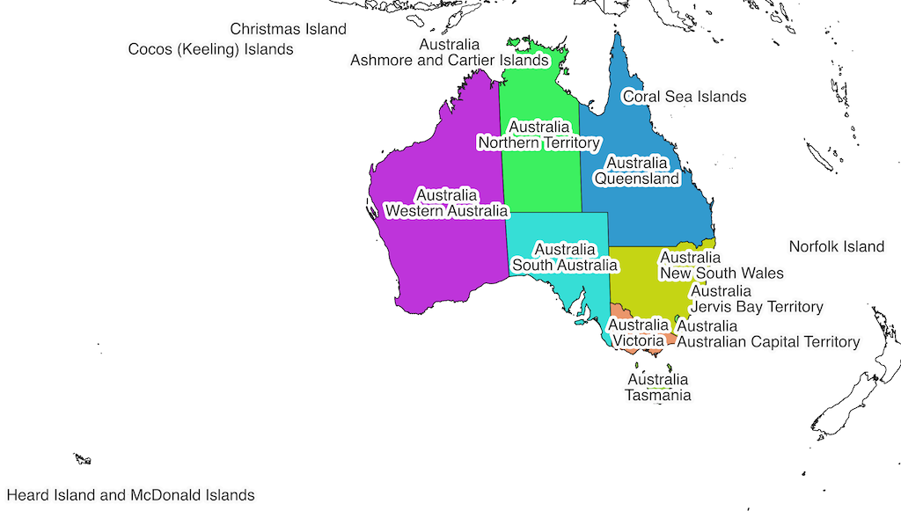

In addition to the country ``Australia``, the Australian states and territories are also provided.

States and internal territories:

* Australian Capital Territory
* New South Wales
* Northern Territory
* Queensland
* South Australia
* Tasmania
* Victoria
* Western Australia
* Jervis Bay Territory

External territories:

* Ashmore and Cartier Islands
* Christmas Island
* Cocos (Keeling) Islands
* Coral Sea Islands
* Heard Island and McDonald Islands
* Norfolk Island

``Australia`` includes all states and internal territories. ``Australia, including overseas territories`` includes all external territories as well as states and internal territories.

The geography ``Australia, Indian Ocean Territories``, consisting of *Christmas Island* and *Cocos (Keeling) Islands* is provided, but its use is not recommended.

Brazilian states
++++++++++++++++

In addition to the country ``Brazil``, the Brazilian states are also provided.

* Acre
* Alagoas
* Amapá
* Amazonas
* Bahia
* Ceará
* Distrito Federal
* Espírito Santo
* Goiás
* Maranhão
* Mato Grosso
* Mato Grosso do Sul
* Minas Gerais
* Paraná
* Paraíba
* Pará
* Pernambuco
* Piauí
* Rio de Janeiro
* Rio Grande do Norte
* Rio Grande do Sul
* Rondônia
* Roraima
* Santa Catarina
* Sergipe
* São Paulo
* Tocantins

Canadian provinces
++++++++++++++++++

In addition to the country ``Canada``, the Canadian provinces are also provided.

* Alberta
* British Columbia
* Manitoba
* New Brunswick
* Newfoundland and Labrador
* Northwest Territories
* Nova Scotia
* Nunavut
* Ontario
* Prince Edward Island
* Québec
* Saskatchewan
* Yukon

Chinese provinces
+++++++++++++++++

In addition to the country ``China``, the Chinese provinces are also provided.

* Anhui (安徽)
* Beijing (北京)
* Chongqing (重庆)
* Fujian (福建)
* Gansu (甘肃)
* Guangdong (广东)
* Guangxi (广西壮族自治区)
* Guizhou (贵州)
* Hainan (海南)
* Hebei (河北)
* Heilongjiang (黑龙江省)
* Henan (河南)
* Hubei (湖北)
* Hunan (湖南)
* Inner Mongol (内蒙古自治区)
* Jiangsu (江苏)
* Jiangxi (江西)
* Jilin (吉林)
* Liaoning (辽宁)
* Ningxia (宁夏回族自治区)
* Qinghai (青海)
* Shaanxi (陕西)
* Shandong (山东)
* Shanghai (上海)
* Shanxi (山西)
* Sichuan (四川)
* Tianjin (天津)
* Xinjiang (新疆维吾尔自治区)
* Xizang (西藏自治区)
* Yunnan (云南)
* Zhejiang (浙江)

Indian states and territories
+++++++++++++++++++++++++++++

In addition to the country ``India``, the Indian states and union territories are also provided.

* Andaman and Nicobar
* Andhra Pradesh
* Arunachal Pradesh
* Assam
* Bihar
* Chandigarh
* Chhattisgarh
* Dadra and Nagar Haveli and Daman and Diu
* Delhi
* Goa
* Gujarat
* Haryana
* Himachal Pradesh
* Jammu and Kashmir
* Jharkhand
* Karnataka
* Kerala
* Lakshadweep
* Madhya Pradesh
* Maharashtra
* Manipur
* Meghalaya
* Mizoram
* Nagaland
* Odisha
* Puducherry
* Punjab
* Rajasthan
* Sikkim
* Tamil Nadu
* Telangana
* Tripura
* Uttar Pradesh
* Uttarakhand
* West Bengal

United States of America states
+++++++++++++++++++++++++++++++

In addition to the country ``United States of America``, the American states and the District of Columbia are also provided.

* Alabama
* Alaska
* Arizona
* Arkansas
* California
* Colorado
* Connecticut
* Delaware
* District of Columbia
* Florida
* Georgia
* Hawaii
* Idaho
* Illinois
* Indiana
* Iowa
* Kansas
* Kentucky
* Louisiana
* Maine
* Maryland
* Massachusetts
* Michigan
* Minnesota
* Mississippi
* Missouri
* Montana
* Nebraska
* Nevada
* New Hampshire
* New Jersey
* New Mexico
* New York
* North Carolina
* North Dakota
* Ohio
* Oklahoma
* Oregon
* Pennsylvania
* Rhode Island
* South Carolina
* South Dakota
* Tennessee
* Texas
* Utah
* Vermont
* Virginia
* Washington
* West Virginia
* Wisconsin
* Wyoming

Changelog
---------

Version 2.5 (Ecoinvent 3.10)
++++++++++++++++++++++++++++

Updated to Natural Earth data version 5.1.1.

Completely rewritten pipeline and scripts using only the province-level Natural Earth data. By not needing to reconcile province and country borders, processing time is reduced from hours to minutes.

* Indian states of ``Dadra and Nagar Haveli`` and ``Daman and Diu`` were `merged in 2020 <https://en.wikipedia.org/wiki/Dadra_and_Nagar_Haveli_and_Daman_and_Diu>`__ to ``Dadra and Nagar Haveli and Daman and Diu``.
* Indian state of ``Orissa`` was renamed to ``Odisha`` in 2011 - we include this change already in 2023.
* Changed ``Turkey`` to ``Türkiye``, and ``Europe, without Russia and Turkey`` to ``Europe, without Russia and Türkiye``.
* Adapted NERC regions as US-SPP and US-FRCC were both dissolved. See `the source repo <https://github.com/ecoinvent/nerc-regions>`__ for more information. The regions ``Southwest Power Pool`` and ``Florida Reliability Coordinating Council`` were removed.
* Add regional Chinese electricity grids.
* Restored ``Brazil, South-eastern and Mid-western grid``.
* The modelling and names for Australia were revamped. See :ref:`Australian states and territories`.

In addition, the aluminium-producing region names ecoinvent is using diverged from the names in this repository, and these have now been brought back to [the ecoinvent standard]((https://github.com/ecoinvent/ecoinvent-topology/commit/a6f1ff9268449e6df5e744f3be23197e0f7e6559).

Version 2.4 (ecoinvent 3.7)
+++++++++++++++++++++++++++

Added ``Europe without Switzerland and Austria``, ``Europe without Austria``, ``China without Inner Mongol``.

Added 50 states of the ``United States of America``, as well as the District of Columbia.

The name of ``Al producing Area 6A&B, West, East, and Central Europe`` (which was in any case an outdated location, and not used in ecoinvent) was changed to ``IAI Area, West Europe``, for consistency with the ecoinvent master data.

Version 2.3 (ecoinvent 3.6)
+++++++++++++++++++++++++++

Split ``Brazil, South-eastern and Mid-western grid`` into ``Brazil, South-eastern grid`` and ``Brazil, Mid-western grid``.

Fixed the short names of the IAI regions to make them consistent with ecoinvent master data:

* ``IAI Area, Europe outside EU & EFTA`` is now ``IAI Area, Russia & RER w/o EU27 & EFTA``
* ``IAI Area 1, Africa`` is now ``IAI Area, Africa``
* ``IAI Area 2, North America`` is now ``IAI Area, North America``
* ``IAI Area 2, without Quebec`` is now ``IAI Area, North America, without Quebec``
* ``IAI Area 3, South America`` is now ``IAI Area, South America``
* ``IAI Area 4&5, without China`` is now ``IAI Area, Asia, without China and GCC``
* ``IAI Area 6, Europe`` is now ``IAI Area, West Europe``
* ``IAI Area 8, Gulf`` is now ``IAI Area, Gulf Cooperation Council``

Added ``Europe without Russia`` and ``North America without Quebec``.

Updated country name of `Eswatini <https://www.iso.org/obp/ui/#iso:code:3166:SZ>`__ and `North Macedonia <https://en.wikipedia.org/wiki/North_Macedonia>`__.

Version 2.2 (ecoinvent 3.4)
+++++++++++++++++++++++++++

The country formerly known as the Czech Republic is now `Czechia <https://www.iso.org/obp/ui/#iso:code:3166:CZ>`__.

Added ``Europe without Germany, the Netherlands, and Russia`` and ``Europe without Switzerland and France``.

Changed the code of Canada without Quebec from ``ROC`` to ``Canada without Quebec``.

Improved consistency in codes and names of provinces to include their countries:

* ``Ashmore and Cartier Islands`` is now ``Australia, Ashmore and Cartier Islands`` (code ``AUS-AC``)
* ``Indian Ocean Territories`` is now ``Australia, Indian Ocean Territories`` (code ``AUS-IOT``)
* ``China Southern Power Grid`` code is now ``CN-CSG``
* ``State Grid Corporation of China`` code is now ``CN-SGCC``
* ``Alaska Systems Coordinating Council`` code is now ``US-ASCC``
* ``Florida Reliability Coordinating Council`` code is now ``US-FRCC``
* ``HICC`` code is now ``US-HICC``
* ``Midwest Reliability Organization, US part only`` code is now ``US-MRO``
* ``Northeast Power Coordinating Council, US part only`` code is now ``US-NPCC``
* ``ReliabilityFirst Corporation`` code is now ``US-RFC``
* ``SERC Reliability Corporation`` code is now ``US-SERC``
* ``Southwest Power Pool`` code is now ``US-SPP``
* ``Texas Regional Entity`` code is now ``US-TRE``
* ``Western Electricity Coordinating Council, US part only`` code is now ``US-WECC``

Changed several country names for consistency with ecoinvent:

* ``Brunei Darussalam`` is now ``Brunei``
* ``Democratic Republic of the Congo`` is now ``Congo, Democratic Republic of the``
* ``Falkland Islands (Malvinas)`` is now ``Falkland Islands``
* ``Hong Kong`` is now ``Hong Kong S.A.R.``
* ``Macau`` is now ``Macao S.A.R``
* ``Micronesia (Federated States of)`` is now ``Micronesia, Federated States of``
* ``Pitcairn`` is now ``Pitcairn Islands``
* ``Republic of Congo`` is now ``Congo``
* ``United Republic of Tanzania`` is now ``Tanzania``
* ``Åland Islands`` is now ``Aland``

Fixed several bugs:

* The new names of some regions in version 2.0 were not properly updated
* All areas of Cyprus are now included in Asia
* Saskatchewan is now included in Canada

Version 2.1 (ecoinvent 3.3)
+++++++++++++++++++++++++++

The following electricity grids were added:

* `Brazil, North-eastern grid`
* `Brazil, Northern grid`
* `Brazil, South-eastern and Mid-western grid`
* `Brazil, Southern grid`
* `India, Islands`
* `India, North-eastern grid`
* `India, Northern grid`
* `India, Southern grid`
* `India, Western grid`

Additionally, all states and union territories in both India and Brazil were added.

The composite geometries `Europe without Germany, the Netherlands, Norway, and Russia` and `Europe without Switzerland and France` were also added.

Version 2.0 (ecoinvent 3.2)
+++++++++++++++++++++++++++

No locations used in ecoinvent 3.01 or 3.1 have been removed, and no location shortnames or UUIDs have been changed. Ecoinvent geography definitions version 2.0 should therefore be backwards-compatible with version 1.0.

The following locations were added:

* `Akrotiri Sovereign Base Area <http://en.wikipedia.org/wiki/Akrotiri_and_Dhekelia>`__
* `Aluminium producing area, EU27 and EFTA countries`
* `Aluminium producing area, Europe outside EU27 and EFTA`
* `Ashmore and Cartier Islands <http://en.wikipedia.org/wiki/Ashmore_and_Cartier_Islands>`__
* `Bajo Nuevo Bank (Petrel Is.) <http://en.wikipedia.org/wiki/Bajo_Nuevo_Bank>`__
* Caribbean (UN subregion)
* `China Southern Power Grid <https://en.wikipedia.org/wiki/China_Southern_Power_Grid_Company>`__
* `Clipperton Island <http://en.wikipedia.org/wiki/Clipperton_Island>`__
* `Coral Sea Islands <http://en.wikipedia.org/wiki/Coral_Sea_Islands>`__ (administrative unit of Australia)
* `Cyprus No Mans Area <http://en.wikipedia.org/wiki/United_Nations_Buffer_Zone_in_Cyprus>`__
* `Dhekelia Sovereign Base Area <http://en.wikipedia.org/wiki/Akrotiri_and_Dhekelia>`__
* `Indian Ocean Territories <http://en.wikipedia.org/wiki/Australian_Indian_Ocean_Territories>`__ (administrative unit of Australia)
* `Kosovo <http://en.wikipedia.org/wiki/Kosovo>`__
* `Northern Cyprus <http://en.wikipedia.org/wiki/Northern_Cyprus>`__
* Russia (Asia)
* Russia (Europe)
* `Scarborough Reef <http://en.wikipedia.org/wiki/Scarborough_Shoal>`__
* `Serranilla Bank <http://en.wikipedia.org/wiki/Serranilla_Bank>`__
* `Siachen Glacier <http://en.wikipedia.org/wiki/Siachen_Glacier>`__
* `Somaliland <http://en.wikipedia.org/wiki/Somaliland>`__
* `State Grid Corporation of China <https://en.wikipedia.org/wiki/State_Grid_Corporation_of_China>`__
* `US Naval Base Guantanamo Bay <http://en.wikipedia.org/wiki/Guantanamo_Bay_Naval_Base>`__

The location ``Al producing Area 6A&B, West, East, and Central Europe``, which was not used in ecoinvent 3.01 or 3.1, has been split into ``Aluminium producing area, EU27 and EFTA countries`` and ``Aluminium producing area, Europe outside EU27 and EFTA``.

.. note:: Sovereign military bases are necessary in version 2 for a consistent world topology.

The following names were changed, mostly due to changes in the source data, or to choose the common instead of formal names:

+------------------------------------------+----------------------------------------------------------+
| New name                                 | Old name                                                 |
+==========================================+==========================================================+
| IAI producing Area 8, Gulf Region        | IAI producing Area 8, Gulf-Aluminium Council/Gulf Region |
+------------------------------------------+----------------------------------------------------------+
| Aland                                    | Åland Islands                                            |
+------------------------------------------+----------------------------------------------------------+
| Bolivia                                  | Bolivia, Plurinational State of                          |
+------------------------------------------+----------------------------------------------------------+
| Bonaire, Saint Eustatius and Saba        | Bonaire, Sint Eustatius, and Saba                        |
+------------------------------------------+----------------------------------------------------------+
| British Virgin Islands                   | Virgin Islands, British                                  |
+------------------------------------------+----------------------------------------------------------+
| Brunei                                   | Brunei Darussalam                                        |
+------------------------------------------+----------------------------------------------------------+
| East Timor                               | Timor-Leste                                              |
+------------------------------------------+----------------------------------------------------------+
| Falkland Islands                         | Falkland Islands (Malvinas)                              |
+------------------------------------------+----------------------------------------------------------+
| French Southern and Antarctic Lands      | French Southern Territories                              |
+------------------------------------------+----------------------------------------------------------+
| Guinea Bissau                            | Guinea-Bissau                                            |
+------------------------------------------+----------------------------------------------------------+
| Hong Kong S.A.R.                         | Hong Kong                                                |
+------------------------------------------+----------------------------------------------------------+
| Iran                                     | Iran (Islamic Republic of)                               |
+------------------------------------------+----------------------------------------------------------+
| Ivory Coast                              | Cote d'Ivoire                                            |
+------------------------------------------+----------------------------------------------------------+
| Laos                                     | Lao People's Democratic Republic                         |
+------------------------------------------+----------------------------------------------------------+
| Macao S.A.R                              | Macau                                                    |
+------------------------------------------+----------------------------------------------------------+
| North Macedonia                          | Macedonia, the Former Yugoslav Republic of               |
+------------------------------------------+----------------------------------------------------------+
| Moldova                                  | Moldova, Republic of                                     |
+------------------------------------------+----------------------------------------------------------+
| North Korea                              | Korea, Democratic People's Republic of                   |
+------------------------------------------+----------------------------------------------------------+
| Palestine                                | Palestinian Territory, Occupied                          |
+------------------------------------------+----------------------------------------------------------+
| Pitcairn Islands                         | Pitcairn                                                 |
+------------------------------------------+----------------------------------------------------------+
| Réunion                                  | Reunion                                                  |
+------------------------------------------+----------------------------------------------------------+
| Russia                                   | Russian Federation                                       |
+------------------------------------------+----------------------------------------------------------+
| South Georgia and South Sandwich Islands | South Georgia and the South Sandwich Islands             |
+------------------------------------------+----------------------------------------------------------+
| South Korea                              | Korea, Republic of                                       |
+------------------------------------------+----------------------------------------------------------+
| Southern Asia                            | South Asia                                               |
+------------------------------------------+----------------------------------------------------------+
| Syria                                    | Syrian Arab Republic                                     |
+------------------------------------------+----------------------------------------------------------+
| Taiwan                                   | Taiwan, Province of China                                |
+------------------------------------------+----------------------------------------------------------+
| Tanzania                                 | Tanzania, United Republic Of                             |
+------------------------------------------+----------------------------------------------------------+
| The Bahamas                              | Bahamas                                                  |
+------------------------------------------+----------------------------------------------------------+
| United States of America                 | United States                                            |
+------------------------------------------+----------------------------------------------------------+
| United States Virgin Islands             | Virgin Islands, U.S.                                     |
+------------------------------------------+----------------------------------------------------------+
| Vatican                                  | Holy See (Vatican City State)                            |
+------------------------------------------+----------------------------------------------------------+
| Vietnam                                  | Viet Nam                                                 |
+------------------------------------------+----------------------------------------------------------+
| Yukon                                    | Yukon Territory                                          |
+------------------------------------------+----------------------------------------------------------+

The following unused locations have been removed:

+----------------------------------------+--------------------------------------------+
| Location                               | Comment                                    |
+========================================+============================================+
| Central and Eastern Europe             |                                            |
+----------------------------------------+--------------------------------------------+
| Christmas Island                       | Now included in `Indian Ocean Territories` |
+----------------------------------------+--------------------------------------------+
| Cocos (Keeling) Islands                | Now included in `Indian Ocean Territories` |
+----------------------------------------+--------------------------------------------+
| Spain, including overseas territories  |                                            |
+----------------------------------------+--------------------------------------------+

Version 1.0 (ecoinvent 3.01 & 3.1)
++++++++++++++++++++++++++++++++++

Initial development. Removal of locations no longer used in the ecoinvent database.

Notes on specific geometries
----------------------------

Some images are large, and can be opened in a separate tab to be seen in full detail.

Global and Rest of the World
++++++++++++++++++++++++++++

The ``Global`` dataset does not have a KML description.

The ``Rest of the world`` dataset is a dynamic concept that exists in the situation when both a global dataset and one or more non-global datasets are available for the same activity, time period, and macro-economic scenario. The definitions is specific to each activity and depends on what defined geographies are available for the specific activity name. It is defined as the difference between the global reference dataset and the datasets with defined geographies. The “rest of world” dataset does not have a set KML description.

UN Regions and subregions
+++++++++++++++++++++++++

UN regions and subregions follow the `UN macro geographical regions`_ definitions.

.. _regions:

UN regions
^^^^^^^^^^

.. note:: ``Taiwan`` is included in the UN region Asia and the UN subregion Eastern Asia, even though it is not officially listed in the UN definitions.

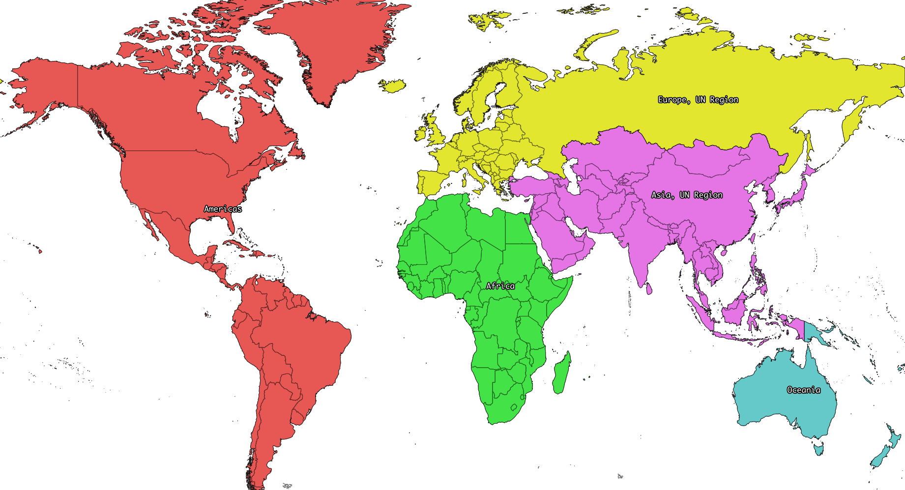

.. _subregions:

UN subregions
^^^^^^^^^^^^^

The UN subregion ``Latin America and the Caribbean``, not shown, includes the Caribbean, and Central and South America.

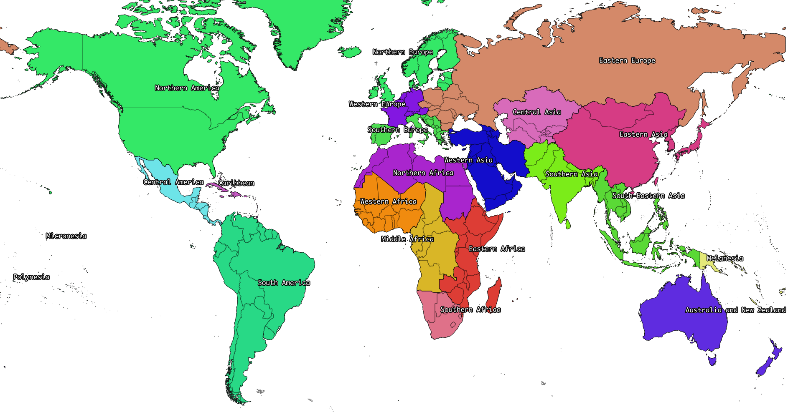

Europe and Asia
+++++++++++++++

The following locations are given:

* ``Europe`` (short name ``RER``)
* ``Asia`` (short name ``RAS``)
* ``Europe, UN Region`` (short name ``UN-EUROPE``)
* ``Asia, UN Region`` (short name ``UN-ASIA``)

We differentiate between the UN definitions of Europe and Asia (which are constrained to including or excluding entire countries), and the common understanding of the border between Europe and Asia. There is no clear line dividing Europe and Asia. The UN regions are defined following the `UN macro geographical regions`_. Russia is split by federal subjects, with the following federal subjects in Europe:

+------------------------+--------------+------------+---------------+
| Adygey                 | Arkhangel'sk | Astrakhan' | Bashkortostan |
+------------------------+--------------+------------+---------------+
| Belgorod               | Bryansk      | Chechnya   | Chuvash       |
+------------------------+--------------+------------+---------------+
| City of St. Petersburg | Dagestan     | Ingush     | Ivanovo       |
+------------------------+--------------+------------+---------------+
| Kabardin-Balkar        | Kaliningrad  | Kalmyk     | Kaluga        |
+------------------------+--------------+------------+---------------+
| Karachay-Cherkess      | Karelia      | Kirov      | Komi          |
+------------------------+--------------+------------+---------------+
| Kostroma               | Krasnodar    | Kursk      | Leningrad     |
+------------------------+--------------+------------+---------------+
| Lipetsk                | Mariy-El     | Mordovia   | Moskovsskaya  |
+------------------------+--------------+------------+---------------+
| Moskva                 | Murmansk     | Nenets     | Nizhegorod    |
+------------------------+--------------+------------+---------------+
| North Ossetia          | Novgorod     | Orel       | Orenburg      |
+------------------------+--------------+------------+---------------+
| Penza                  | Perm'        | Pskov      | Rostov        |
+------------------------+--------------+------------+---------------+
| Ryazan'                | Samara       | Saratov    | Smolensk      |
+------------------------+--------------+------------+---------------+
| Stavropol'             | Tambov       | Tatarstan  | Tula          |
+------------------------+--------------+------------+---------------+
| Tver'                  | Udmurt       | Ul'yanovsk | Vladimir      |
+------------------------+--------------+------------+---------------+
| Volgograd              | Vologda      | Voronezh   | Yaroslavl'    |
+------------------------+--------------+------------+---------------+

The following Russian federal subjects are in Asia:

+---------------+--------------------------+-------------+-----------------+
| Altay         | Amur                     | Buryat      | Chelyabinsk     |
+---------------+--------------------------+-------------+-----------------+
| Chita         | Chukchi Autonomous Okrug | Gorno-Altay | Irkutsk         |
+---------------+--------------------------+-------------+-----------------+
| Kamchatka     | Kemerovo                 | Khabarovsk  | Khakass         |
+---------------+--------------------------+-------------+-----------------+
| Khanty-Mansiy | Krasnoyarsk              | Kurgan      | Maga Buryatdan  |
+---------------+--------------------------+-------------+-----------------+
| Novosibirsk   | Omsk                     | Primor'ye   | Sakha (Yakutia) |
+---------------+--------------------------+-------------+-----------------+
| Sakhalin      | Sverdlovsk               | Tomsk       | Tuva            |
+---------------+--------------------------+-------------+-----------------+
| Tyumen'       | Yamal-Nenets             | Yevrey      |                 |
+---------------+--------------------------+-------------+-----------------+

.. note:: The definition of ``Europe`` and ``Asia`` have changed in version 2.0, to match Russian federal subject borders. In version 1.0, ``Europe`` also included parts of Kazakhstan, Azerbaijan, Georgia, and Türkiye - these countries are now completely inside ``Asia``.

.. note:: Both ``Europe`` and ``Europe, UN Region`` include all of Spain, including the Canary Islands and a few small exclaves in Africa.

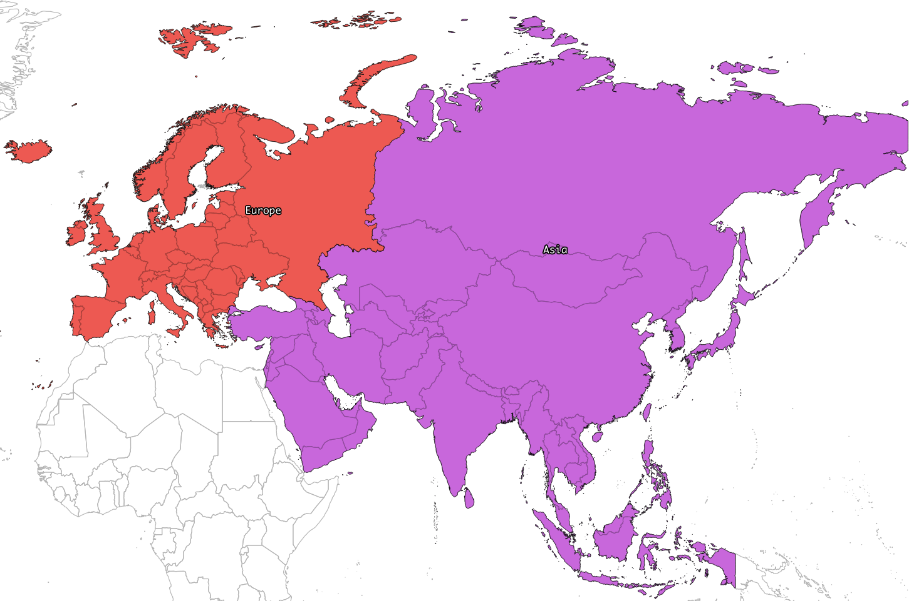

In addition to the country ``Russia``, the regions ``Russia (Asia)`` and ``Russia (Europe)`` are given, following the federal subject boundaries given above.

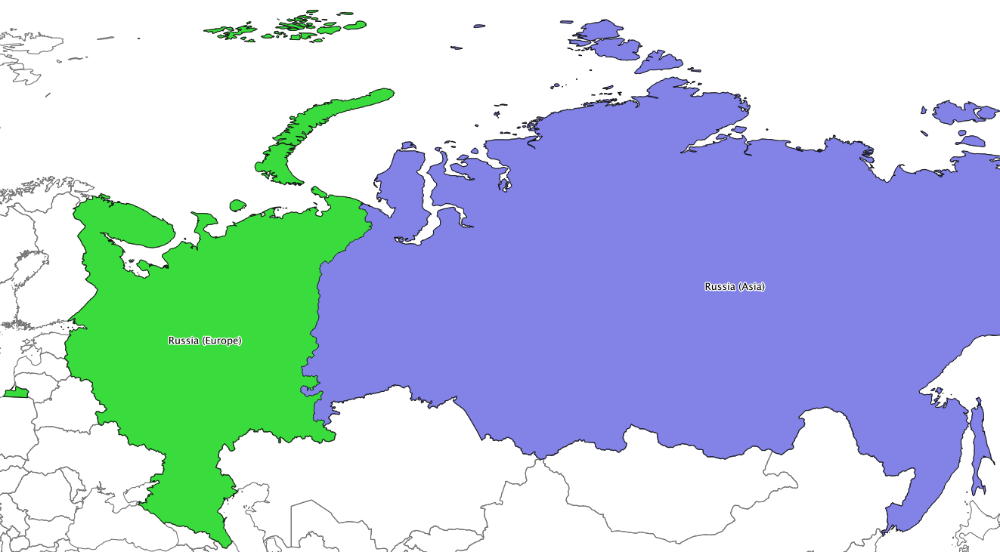

.. _aluminium:

Aluminium-producing regions
+++++++++++++++++++++++++++

Aluminium is not produced in every country in the world, and the following producing regions are given:

* IAI producing Area 1, Africa
* IAI producing Area 2, North America
* IAI producing Area 2, North America, without Quebec
* IAI producing Area 3, South America
* IAI producing Area 4 and 5, South and East Asia, without China
* Aluminium producing area, EU27 and EFTA countries
* Aluminium producing area, Europe outside EU27 and EFTA
* IAI producing Area 8, Gulf Region

Note that there is an overlap between ``IAI producing Area 2, North America`` and ``IAI producing Area 2, North America, without Quebec``.

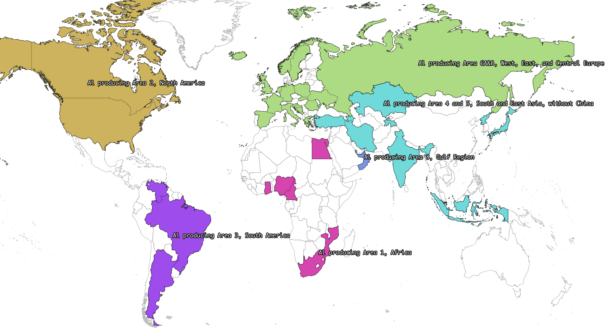

Electricity networks
++++++++++++++++++++

Sub-national electricity grids are provided for China, Brazil, North America, and India.

.. _elecna:

North American networks
^^^^^^^^^^^^^^^^^^^^^^^

In the United States and Canada, the boundaries between NERC regions is made up of state/province boundaries and hand-drawn boundaries traced from NERC maps.

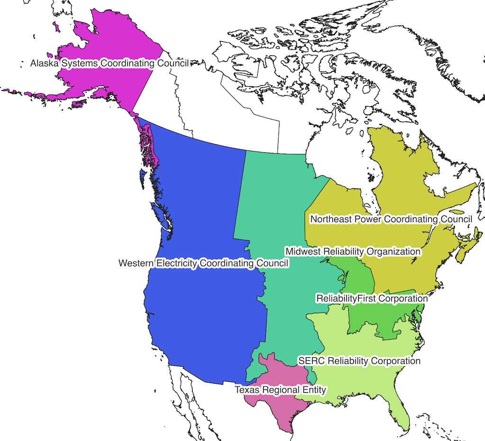

.. _elecusa:

USA-only subnetworks
^^^^^^^^^^^^^^^^^^^^

NERC regions which cross the Canadian border have also been split into USA-only networks for market reasons.

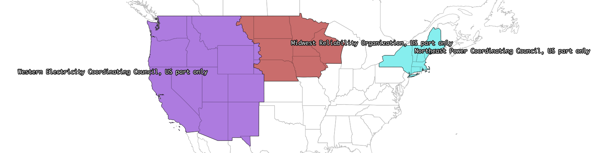

India
^^^^^

India has been split into five electricity grids. The location `India, Islands` contains both Andaman and Nicobar, and Lakshadweep.

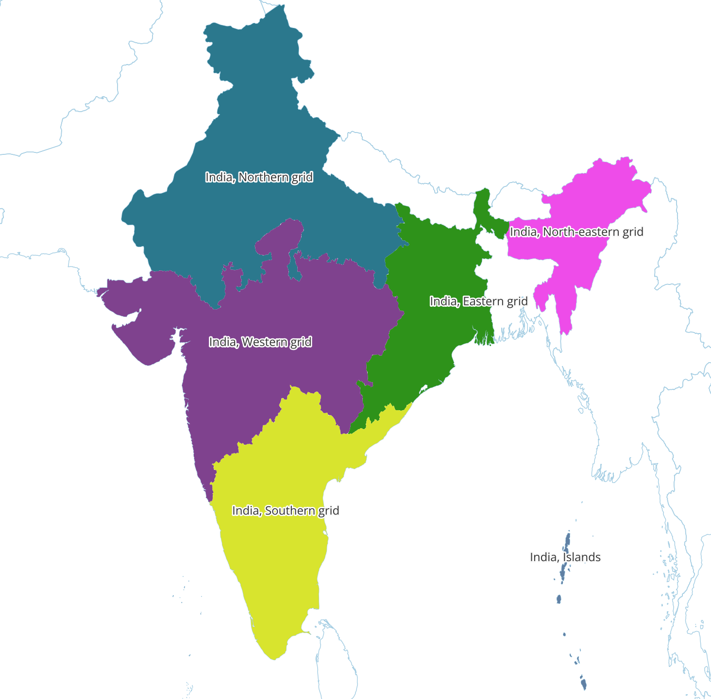

Brazil
^^^^^^

Brazil has been split into four electricity grids.

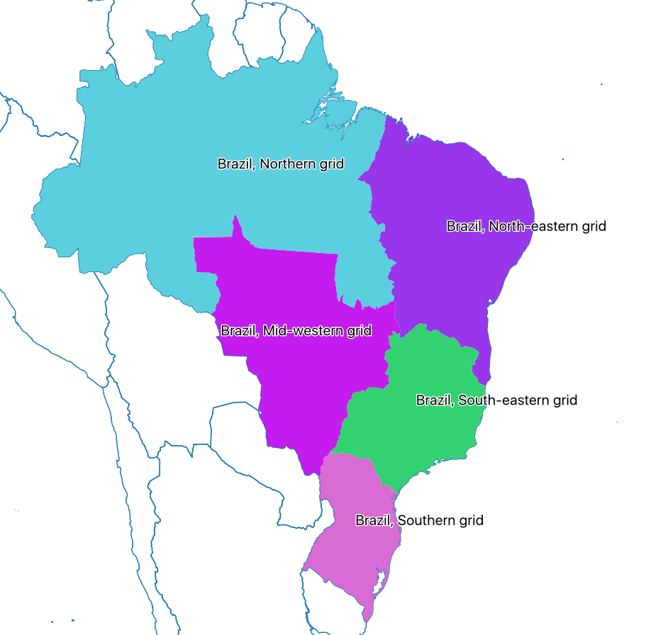

China
^^^^^

China has been split into six electricity grids.

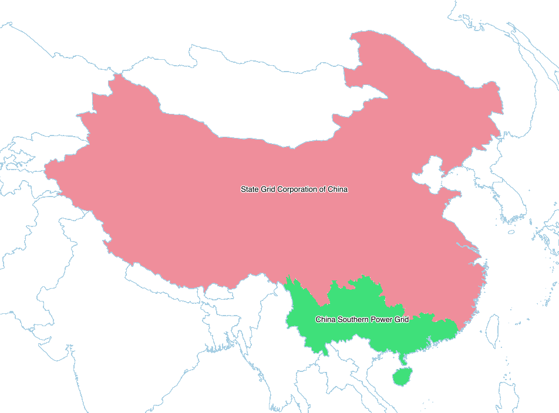

.. _eleceu:

Legacy networks
^^^^^^^^^^^^^^^

In addition to these current networks, the following legacy European networks are provided:

* Nordic Countries Power Association
* Union for the Co-ordination of Electricity
* Baltic System Operator

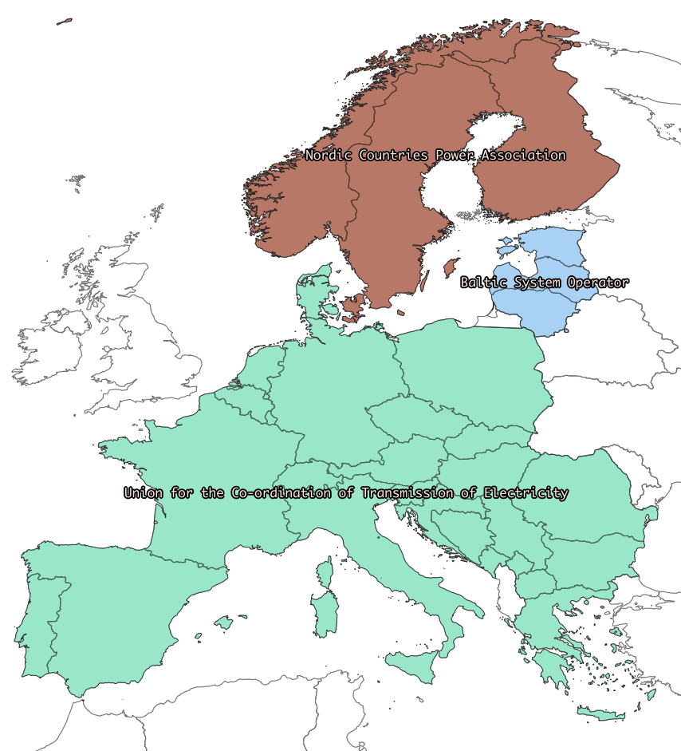

* Central European Power Association

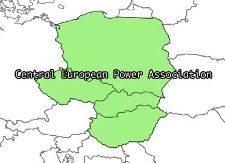

Norway
++++++

``Bouvet Island`` and ``Svalbard and Jan Mayen`` are distinct locations with `ISO 3166-1`_ codes and are not included in ``Norway``.

.. _france:

France
++++++

``France`` is what is commonly called `metropolitan France <http://en.wikipedia.org/wiki/Metropolitan_France>`__. It does not include the following locations which all have `ISO 3166-1`_ codes:

* French Guiana
* French Polynesia
* French Southern and Antarctic Lands
* Guadeloupe
* Martinique
* Mayotte
* New Caledonia
* Réunion
* Saint Barthélemy
* Saint Martin
* Saint Pierre and Miquelon
* Wallis and Futuna

In addition, ``France`` does not include the uninhabited ``Clipperton Island``, which is given as a separate location.

The location ``France, including overseas territories`` includes metropolitan France, as well as ``French Guiana``, ``Guadeloupe``, ``Martinique``, ``Mayotte``, and ``Réunion``.

.. _spain:

Spain
+++++

``Spain`` includes the `Canary Islands <http://en.wikipedia.org/wiki/Canary_Islands>`__, `Ceuta <http://en.wikipedia.org/wiki/Ceuta>`__, `Melilla <http://en.wikipedia.org/wiki/Melilla>`__, and the `Plazas de soberanía <http://en.wikipedia.org/wiki/Plazas_de_soberanía>`__.

Micronesia
++++++++++

The country is called ``Micronesia, Federated States of``. The UN subregion is called ``Micronesia``.

Cyprus
++++++

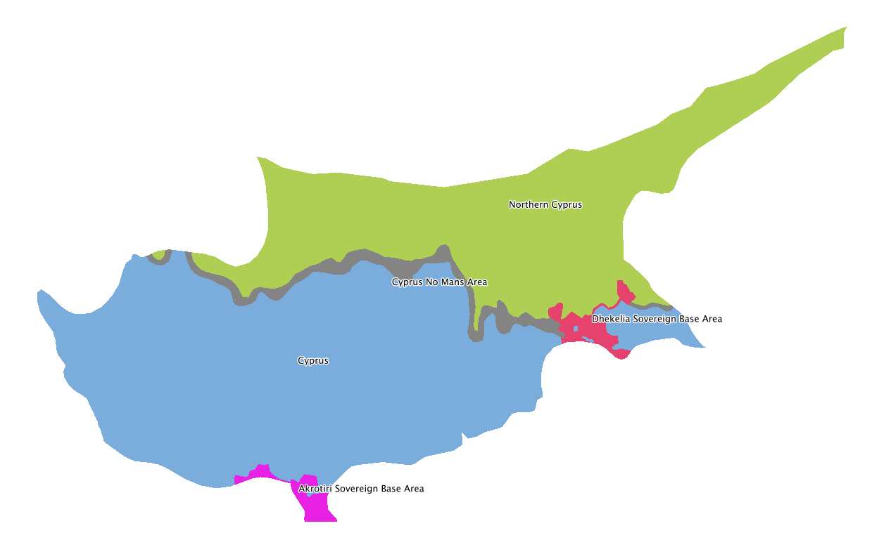

Due to `ongoing territorial disputes <http://en.wikipedia.org/wiki/Cyprus_dispute>`__, the island of Cyprus is split into the following:

* `Akrotiri Sovereign Base Area <http://en.wikipedia.org/wiki/Akrotiri_and_Dhekelia>`__
* `Cyprus <http://en.wikipedia.org/wiki/Cyprus>`__
* `Cyprus No Mans Area <http://en.wikipedia.org/wiki/United_Nations_Buffer_Zone_in_Cyprus>`__
* `Dhekelia Sovereign Base Area <http://en.wikipedia.org/wiki/Akrotiri_and_Dhekelia>`__
* `Northern Cyprus <http://en.wikipedia.org/wiki/Northern_Cyprus>`__

United States of America
++++++++++++++++++++++++

The location ``United States of America`` includes the 50 states and Washington D.C. The following are given as separate locations:

* American Samoa
* Guam
* Northern Mariana Islands
* Puerto Rico
* United States Minor Outlying Islands
* United States Virgin Islands

.. _`UN macro geographical regions`: http://unstats.un.org/unsd/methods/m49/m49regin.htm

.. _`ISO 3166-1`: http://en.wikipedia.org/wiki/ISO_3166-1
